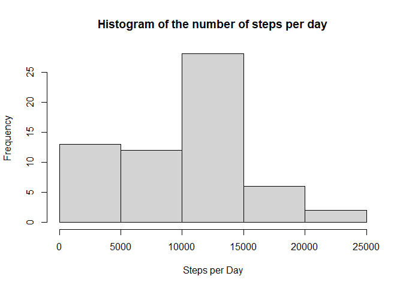
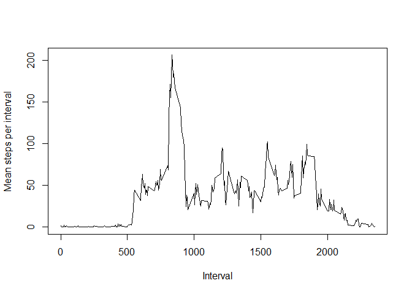
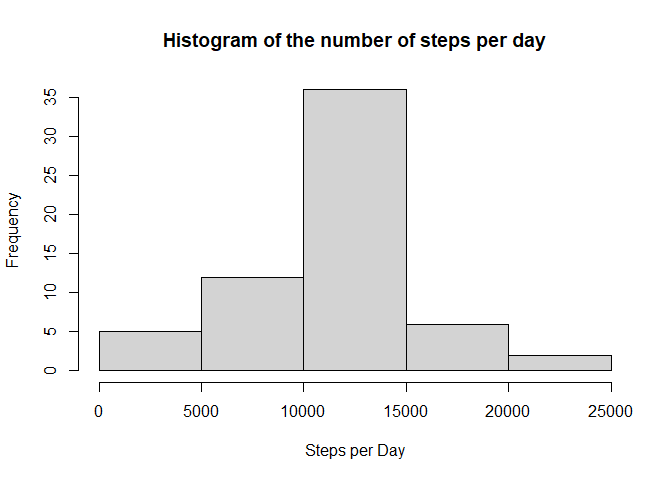
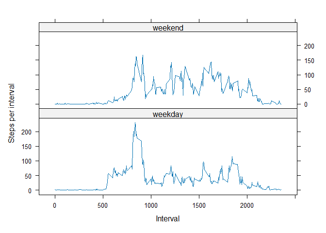

<!-- Reproducible Research: Peer Assessment 1 -->
<!-- ======================================== -->


## Loading and preprocessing the data

```r
library(data.table)

activity <- fread(unzip("activity.zip"))
activity$date <- as.Date(activity$date)
summary(activity)
```

```
##      steps             date               interval     
##  Min.   :  0.00   Min.   :2012-10-01   Min.   :   0.0  
##  1st Qu.:  0.00   1st Qu.:2012-10-16   1st Qu.: 588.8  
##  Median :  0.00   Median :2012-10-31   Median :1177.5  
##  Mean   : 37.38   Mean   :2012-10-31   Mean   :1177.5  
##  3rd Qu.: 12.00   3rd Qu.:2012-11-15   3rd Qu.:1766.2  
##  Max.   :806.00   Max.   :2012-11-30   Max.   :2355.0  
##  NA's   :2304
```


## What is mean total number of steps taken per day?

```r
activityDay <- activity[,.(stepsDay=sum(steps, na.rm=T)),by=date] 
meanDay <- as.integer(activityDay[,mean(stepsDay,na.rm = T)])
medianDay <- as.integer(activityDay[,median(stepsDay,na.rm = T)])
hist(activityDay$stepsDay,xlab = "Steps per Day", 
     main = "Histogram of the number of steps per day")
```

<!-- -->

The mean number of steps per day is 9354 and the median 10395


## What is the average daily activity pattern?


```r
activityInterval <- activity[,.(stepsInterval=mean(steps,na.rm=T)),by=interval]
plot(activityInterval$interval,activityInterval$stepsInterval,type="l", 
     xlab="Interval",ylab="Mean steps per interval")
```

<!-- -->

```r
maxInterval <- activityInterval[which.max(stepsInterval), interval]
```

The interval with a highest average number steps is 835.

## Imputing missing values

We impute missing step values by using the mean value for the given interval accross al days.


```r
narows <- nrow(activity) - sum(complete.cases(activity))
activity.fix <- copy(activity)
activity.fix$steps <- as.double(activity.fix$steps)
impute.mean <- function(x) replace(x, is.na(x), mean(x, na.rm = TRUE))
activity.fix[,steps:=impute.mean(steps),by=interval]

activityDay.fix <- activity.fix[,.(stepsDay=sum(steps, na.rm=T)),by=date] 

meanDay.fix <- as.integer(activityDay.fix[,mean(stepsDay,na.rm = T)])
medianDay.fix <- as.integer(activityDay.fix[,median(stepsDay,na.rm = T)])
hist(activityDay.fix$stepsDay,xlab = "Steps per Day", 
     main = "Histogram of the number of steps per day")
```

<!-- -->

There are 2304 records with missing values. If we impute them, the mean number of steps per day is then 10766 and the median 10766


## Are there differences in activity patterns between weekdays and weekends?

```r
library(lubridate,quietly = T,warn.conflicts = F)
activity.fix[,daytype:="weekday"]
activity.fix[wday(activity.fix$date, week_start = 1) %in% 6:7, daytype:="weekend"]
activity.fix[,daytype:=as.factor(daytype)]

activityInterval.fix <- activity.fix[,.(stepsInterval=mean(steps,na.rm=T)),by=.(daytype,interval)]
library(lattice)
xyplot(stepsInterval~interval|daytype,data=activityInterval.fix,type="l",
       layout=c(1,2), ylab = "Steps per interval", xlab="Interval")
```

<!-- -->

